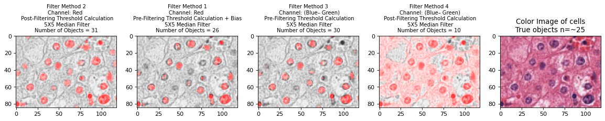
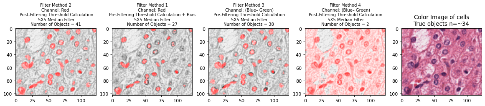
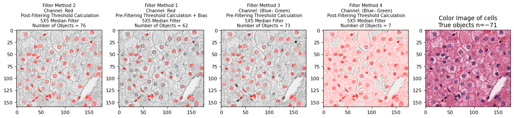
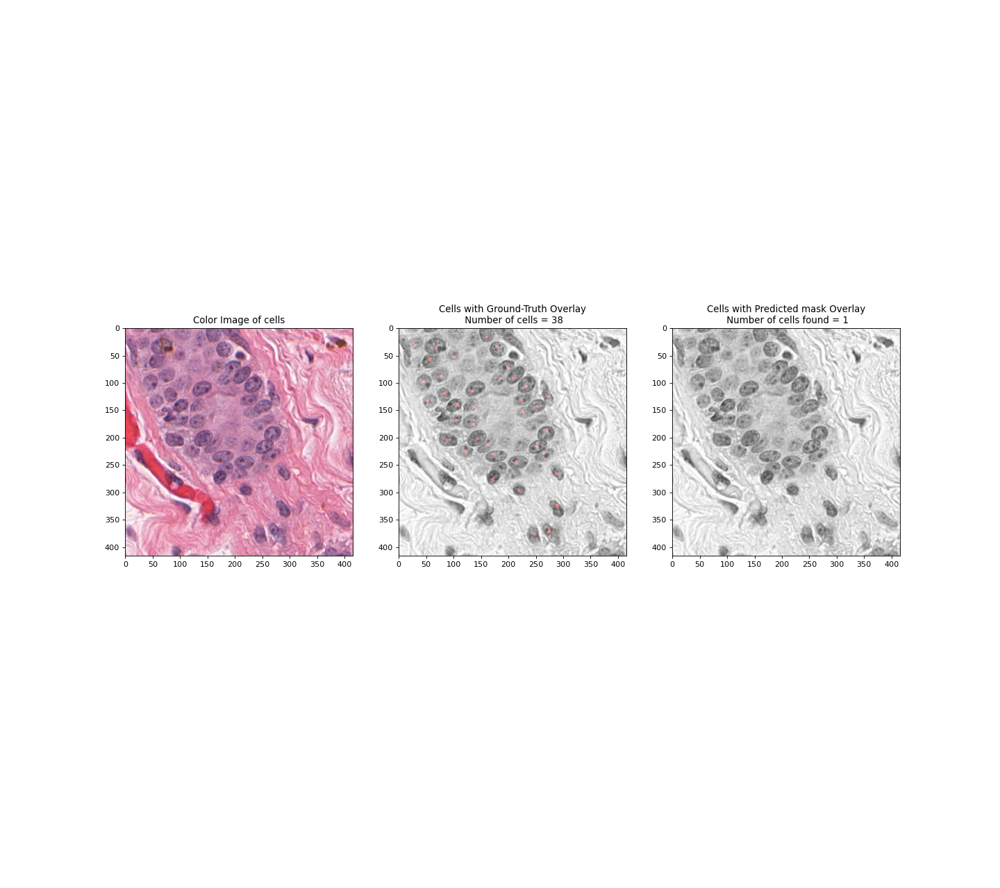
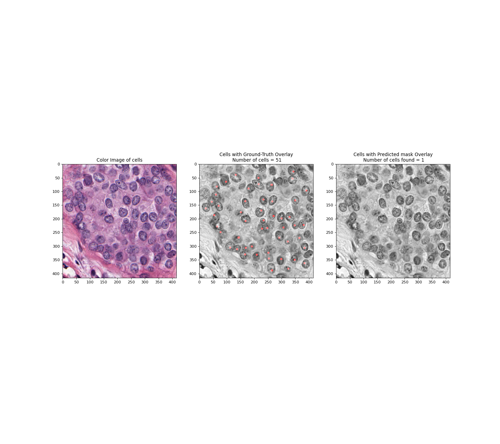
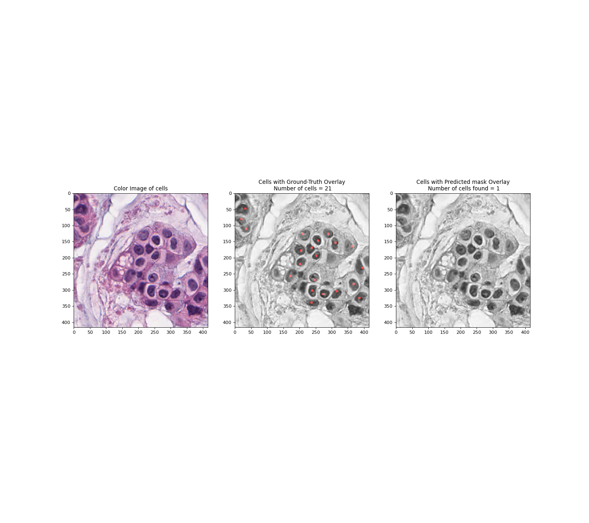
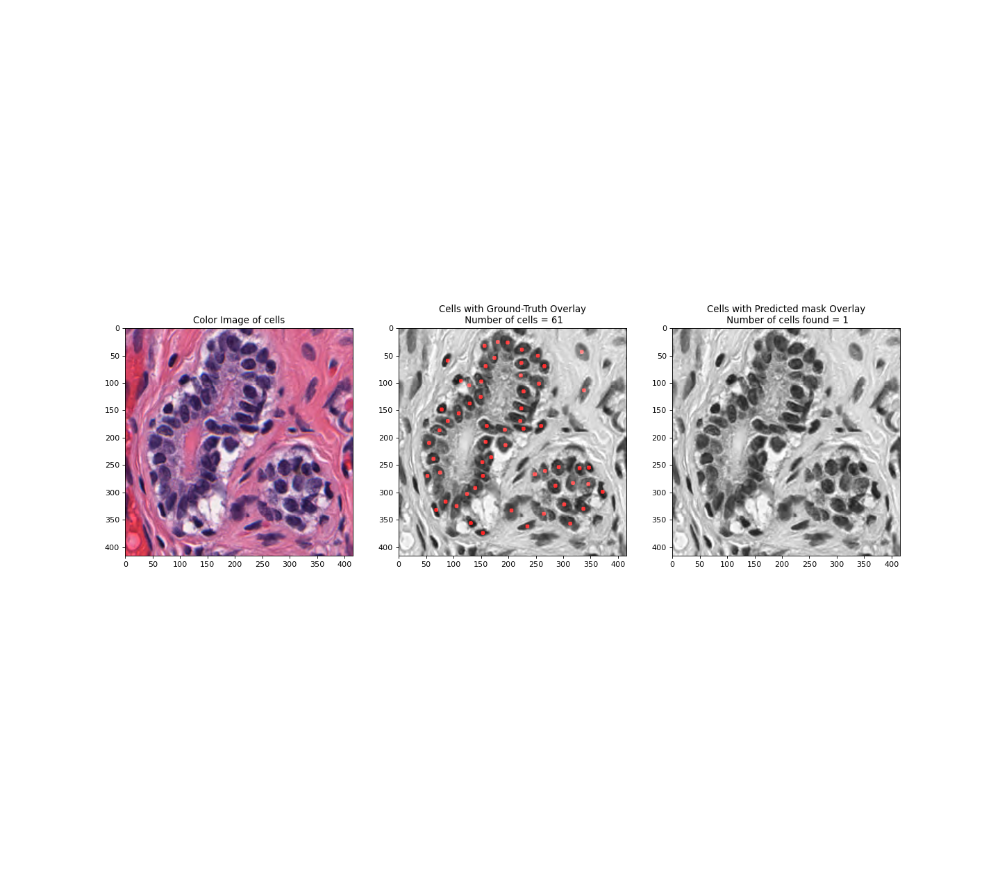

# 1-cells project
This is my R project for cell segmentation and counting
The graph results are in the folder `./deliverables/` and `./deliverables/results_15_epochs`

## Methods (steps)
#### Python vision method in `final_cell_segmentation_script.ipynb`
* Partially based on [Python Image Tutorial](http://pythonvision.org/basic-tutorial/)

#### Deep Learning image segmentation using UNet in `keras_tf_cell_segmentation`
* Partially based on [Image segmentation with a U-Net-like architecture](https://keras.io/examples/vision/oxford_pets_image_segmentation/)
* [U-Net: Convolutional Networks for Biomedical Image Segmentation.](https://arxiv.org/abs/1505.04597)

## Results
 Not terribly accurate, though python vision B-G channel method got within 5 counts consitently.

## What I would do to improve deep learning 
There could be a number of reasons why the deep learning algorithms did not work well. In no particular order if I had more time and/or resources I would: 
1. Transfer learn on larger non-medical and medical datasets, 
1. Acquire more labeled H&E stain images (I have ~320)
1. Implement patience and learning rate reductions so I can have a variable number of epochs
1. Use parameter optimization to determine best optimizer and loss algorithms (that work best for this counting problem).

## FCRN
#### Another potential deep learning model

FCRN Model suggested in:
* [Improving Nuclei Classification Performance in H&E Stained Tissue Images Using Fully Convolutional Regression Network and Convolutional Neural Network][id1]
* [Microscopy Cell Counting with Fully Convolutional Regression Networks][id2]

[github]: https://github.com/WeidiXie/cell_counting_v2 "GitHub WiediXie"
[id1]: https://ieeexplore-ieee-org.proxy.library.upenn.edu/document/8707397 
[id2]: http://www.robots.ox.ac.uk/~vgg/publications/2015/Xie15/weidi15.pdf

#### links
1. https://github.com/WeidiXie/cell_counting_v2
1. https://ieeexplore-ieee-org.proxy.library.upenn.edu/document/8707397 
1. http://www.robots.ox.ac.uk/~vgg/publications/2015/Xie15/weidi15.pdf

## Plots
#### Simple filtering and Python vision

#### Deep Learning

