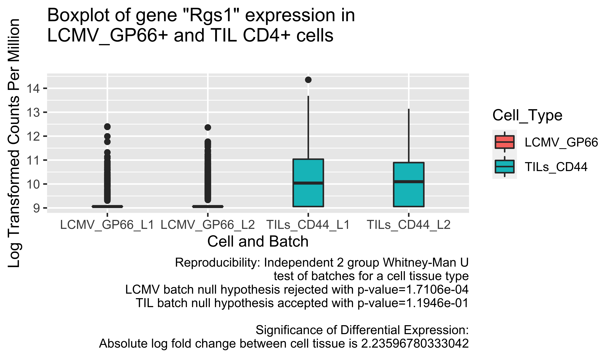
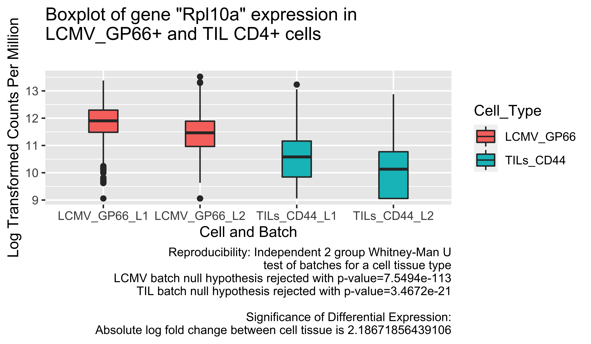
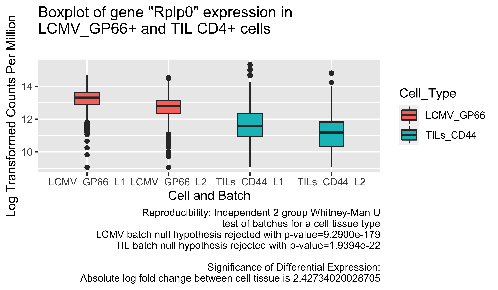

# 2-genetics project
This is my R project for genetics
The graph results are in the folder ./deliverables/

## Methods (steps)
1. extract GSM matrix (.mtx) files as counts
2. reduced samples to just correspond to LCMV_GP66+ ("GSM3543444" & "GSM3543448") and TILs_CD44+_PD+ ("GSM3543446" "GSM3543449")
3. deleted any gene with below 1 CPM across all columns
4. TMM normalized gene epression and converted to Log-CPM
5. Used the treat method to find genes with significant cell type difference of LogFC greater than 2
      * This left 12 genes with signficant difference across group
6. Used Independent 2 group Whitney-Man U test (a=.05) to test for reproducibility differences between batches across each of the selected samples
      * within groups, batches were all but twice (out of 12) significantly different from each other, suggesting significant batch differences.

## Results
 1. **Significant genes**
    * 12 genes were selected for having above 2.0 Log Fold Changes across Cell Types based on the treat method
    * Given more time I would do more filtering on genes (to make more of an on/off distinction with final genes chosen) and use the recomended benjamini–Hochberg procedure with the chosen LFC and Q values.
 2. **Reproducibility of trends** 
    * It appears that these trends are not reproducible according to the statistical test chosen. 

## Discussion of Reproducibility and next steps: 
In an ideal world I would set logFC to be 1.25 (same as used in the paper that was included) and filter through more than just the top 12 genes. If both null hypotheses are not rejected then the trends would appear to be reproducible. Additionally, to analyze reproducibility on a larger scale I would normalize the genes to show expression relative to the controls (which I was unable to determine) and perform these statistical tests on all nonzero genes to see if they have the same expression relative to the controls or spike-ins. 

## Plots

## References
1. [Using Limma-Voom](https://ucdavis-bioinformatics-training.github.io/2018-June-RNA-Seq-Workshop/thursday/DE.html)
2. [RNA-seq analysis is easy as 1-2-3 with limma, Glimma and edgeR](https://www.bioconductor.org/packages/devel/workflows/vignettes/RNAseq123/inst/doc/limmaWorkflow.html#differential-expression-analysis)
